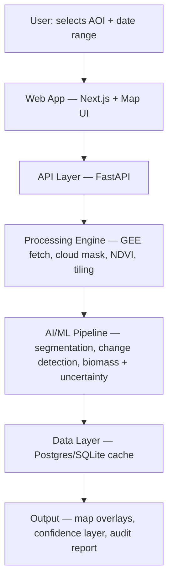

# SylvaSense

**Canopy density, forest-change detection & aboveground biomass (AGB) estimation from open satellite imagery.**

> ORION 1.0 — ORION-PS-03 (Earth Observation AI) · Team: Core Signal

SylvaSense is a satellite-driven monitoring pipeline that fuses Sentinel-2 optical and
Sentinel-1 SAR imagery (via Google Earth Engine) into repeatable, explainable canopy
and biomass metrics — with every output carrying a cited model, an uncertainty range,
and a confidence flag. We deliberately do **not** claim individual-tree counts at
10m resolution; see [`docs/methodology.md`](docs/methodology.md) for why, and what
we claim instead.

## Why this exists

Forestry departments and carbon-credit verifiers rely on slow, expensive
ground-based canopy surveys with no scalable, repeatable way to monitor large
forest regions or verify canopy/carbon claims over time. SylvaSense turns free,
open Sentinel data into an audit-ready monitoring layer.

## Architecture



Full breakdown, tech choices and fallback design: [`docs/architecture.md`](docs/architecture.md)

## Repo layout

```
sylvasense/
├── backend/
│   └── app/
│       ├── main.py                # FastAPI entrypoint (sample endpoint included)
│       └── pipeline/
│           ├── ingestion.py       # GEE Sentinel-1/2 fetch
│           ├── preprocessing.py   # cloud mask, NDVI, tiling
│           ├── segmentation.py    # canopy density segmentation (+ classical fallback)
│           ├── change_detection.py# multi-date diff (flagship feature)
│           └── biomass.py         # allometric AGB + uncertainty (Chave et al. 2014)
├── frontend/                      # Next.js map dashboard (see frontend/README.md)
├── docs/
│   ├── architecture.md
│   ├── methodology.md             # honest framing + resolution-limit explanation
│   ├── model_card_template.md     # filled in per model release
│   └── demo_script.md             # 3-min video / live-defense script
├── tests/
│   └── test_pipeline.py           # 7 unit tests, run in CI on every push
├── .github/workflows/ci.yml       # GitHub Actions: pytest on push/PR
├── Dockerfile
├── .env.example
├── notebooks/
│   └── demo_pipeline.ipynb        # NDVI + canopy density walkthrough on a demo AOI
├── data/cache/                    # pre-fetched demo AOIs (offline-safe demo)
└── requirements.txt
```

## Quickstart

```bash
python -m venv .venv && source .venv/bin/activate
pip install -r requirements.txt
pytest tests/ -v                       # 7 tests, no GEE auth needed
uvicorn backend.app.main:app --reload
# → GET http://localhost:8000/api/aoi/AOI-014/result
```

Or with Docker: `docker build -t sylvasense . && docker run -p 8000:8000 sylvasense`

CI runs the same test suite on every push — see `.github/workflows/ci.yml`.

## Key references

- Chave, J. et al. (2014). *Improved allometric models to estimate the aboveground
  biomass of tropical trees.* Global Change Biology.
- Gorelick, N. et al. (2017). *Google Earth Engine: Planetary-scale geospatial
  analysis for everyone.* Remote Sensing of Environment.
- ESA Copernicus — Sentinel-1 (SAR) & Sentinel-2 (optical) mission documentation.
- Global Forest Watch (WRI) — external ground-truth sanity-check layer.
- Verra VM0007 REDD+ Methodology Framework — output-schema alignment reference.
- Mitchell, M. et al. (2019). *Model Cards for Model Reporting* — practice followed
  in `docs/model_card_template.md`.

## Status

Hackathon MVP for ORION 1.0, Round 1 submission. Not production-grade — see
[`docs/architecture.md`](docs/architecture.md) for the MUST/SHOULD/NICE-TO-HAVE
build breakdown and honest scalability notes.

## License

MIT — see [`LICENSE`](LICENSE).
