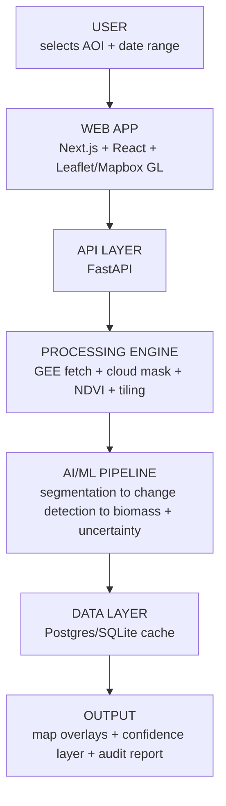

# Architecture

## Flow

## Component table

| Layer | Tech | Input | Output | Failure mode | Fallback |
|---|---|---|---|---|---|
| Web App | Next.js, React, Leaflet/Mapbox GL, Recharts | AOI polygon, date range | Map view + results panel | Large raster overlay lag | Static PNG overlay |
| API Layer | FastAPI | HTTP request | JSON / GeoJSON | Long-running job timeout | Async polling endpoint |
| Processing Engine | Google Earth Engine Python API | AOI + dates | Clean multiband tiles | GEE quota / cloud cover | Cached GeoTIFFs per demo AOI |
| AI/ML Pipeline | PyTorch, NumPy, rasterio | Clean tiles | Canopy density, change flag, AGB range | Model uncertain / no labels | Classical NDVI watershed CV |
| Data Layer | PostgreSQL / SQLite | Pipeline outputs | Cached, queryable results | Cache miss on stage | Pre-seed cache before demo |
| Output | Map overlay + PDF report | JSON/GeoJSON | Visual + exportable report | — | On-screen only if export fails |

## Build priority

**MUST BUILD:** AOI selector w/ cached presets, Sentinel-2 fetch + NDVI, canopy density
segmentation, change detection (flagship), biomass range with cited model, confidence
layer, map dashboard, offline-safe cached demo path.

**SHOULD BUILD:** fine-tuned segmentation model, Sentinel-1 SAR (scoped to one job:
cloud-gap fill / saturation flag), PDF report export, Postgres/PostGIS.

**NICE TO HAVE:** multi-AOI comparison view, historical multi-date trend charts.

**DO NOT BUILD:** blockchain "carbon credit" ledger, ESP32/edge deployment, real-time
drone/video processing, training a segmentation model from scratch, multi-tenant auth.

## Why every layer has a fallback

A live demo that depends on a network call is a demo that can fail on stage. Every
external dependency (GEE, live inference) has a cached or classical fallback so the
judged demo never depends on live infrastructure.
